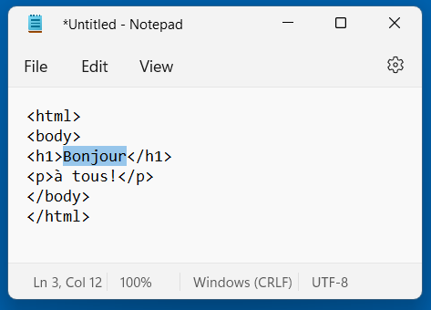

#  [HTML CSS JavaScript en français](https://j-m-li.github.io/htmlcssjavascript/)


## Introduction

[Introduction simple et rapide](https://j-m-li.github.io/htmlcssjavascript/) à HTML5, CSS3 et JavaScript.


### HTML

Une page "web" HTML est un fichier [texte pur](https://fr.wikipedia.org/wiki/Fichier_texte) sauvegardé avec l'extension ``.html`` au lieu de ``.txt`` .
(Donc il n'y a besoin d'aucun logiciel particulier pour créer un fichier HTML!)

Ce fichier contient des [balises](https://developer.mozilla.org/fr/docs/Web/HTML/Element) et des entités inspirées du format [XML](https://developer.mozilla.org/fr/docs/Web/XML/XML_introduction), ainsi que du texte.


Il y a 3 types de balises : 

* Les balises d'ouverture qui débutent un élément, par exemple ``<h1>``

* Les balises de fermeture qui terminent un élément, par exemple ``</h1>``

* Les balises vides qui définissent un élément vide, par exemple ``<br/>``. (En HTML le ``/`` est optionnel, ``<br>`` est aussi valide.)

Les balises vides ou d'ouverture peuvent avoir des attributs et leur valeur, par exemple ``<p lang="fr">``

Il y a une [multitude d'entités](https://html.spec.whatwg.org/multipage/named-characters.html) qui peuvent être utilisées dans le texte, mais celles à connaître absolument sont :

* ``&lt;`` qui remplace ``<``

* ``&amp;`` qui remplace ``&``

* ``&quot;`` qui remplace ``"``

* ``&nbsp;`` qui remplace un espace `` `` non sécable.

* ``&#x10BEEF;`` qui insert un caractère [Unicode](https://unicode.org/emoji/charts/emoji-list.html) dont la valeur hexadécimale est "10BEEF".

#### Voici un exemple des plus simples : 

```
<html lang="fr">
  <body>
    <h1>Bonjour</h1>
    <p>à toutes &amp; à tous!</p>
    &#x1F600;
  </body>
</html>
```


&#x1F578; [Voir le résultat](https://j-m-li.github.io/htmlcssjavascript/html/exemple_001.html)

### [&#x2B95; suite du cours &#x2B95;](md/002/) 

***

[&#x1F517; liens utils](md/900/) -- Domaine Public MMXXII par Jean-Marc Lienher
