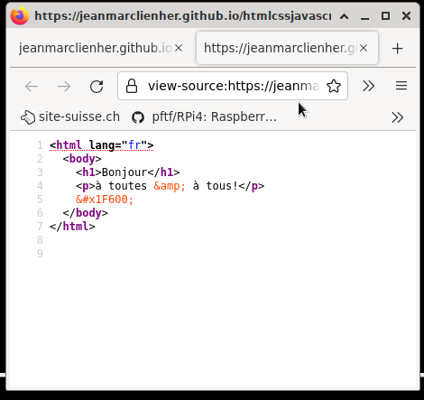
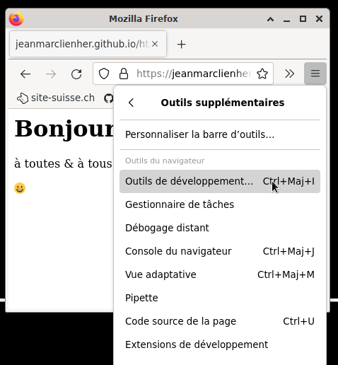
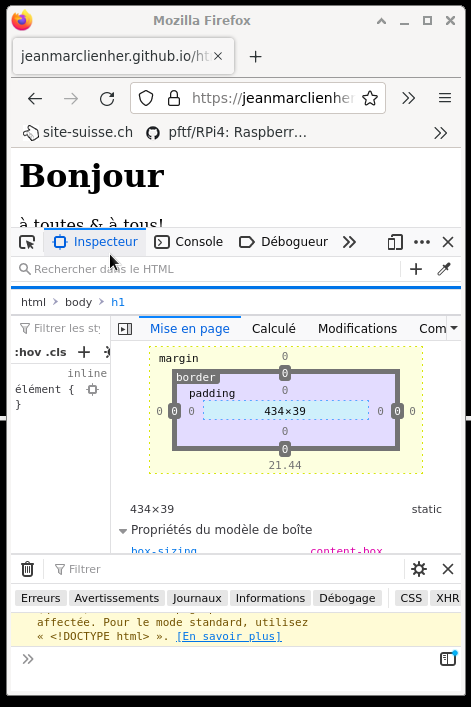

#  [HTML CSS JavaScript en français](https://jeanmarclienher.github.io/htmlcssjavascript/)

## Utiliser les outils de développement du navigateur

***

### Voir le code source de la page

C'est l'outil basic de votre navigateur qui permet de voir le contenu de la page HTML.
Avec Firefox, il s'ouvre avec le menu contextuel (clic-droit).

### Outils de développement

Ces outils permettent de déboguer votre code.

Avec Firefox, ils s'ouvrent avec le menu ''&#9776;'' &#x2B95; ''outils supplémentaires'' &#x2B95; ''Outils de développement...''.

### Vérifier que le balisage est correcte.

[W3 validator](https://validator.w3.org/#validate_by_input).

### [&#x2B95; suite du cours &#x2B95;](../004/) 

***

[&#x1F517; liens utils](../900/) -- Domaine Public MMXXII par Jean-Marc Lienher

