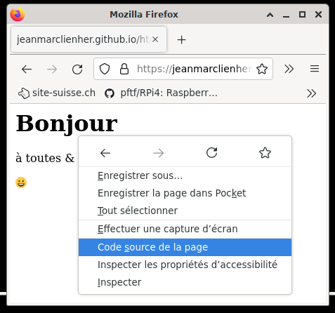

#  [HTML CSS JavaScript en français](https://jeanmarclienher.github.io/htmlcssjavascript/)

## Utiliser les outils de développement du navigateur

***

### Voir le code source de la page

C'est l'outils basic de votre navigateur qui permet de voir le contenu de la page HTML.

[&#x1F578; voir le résultat](../../html/exemple_003.html)

### [&#x2B95; suite du cours &#x2B95;](../004/) 

***

[&#x1F517; liens utils](../900/) -- Domaine Public MMXXII par Jean-Marc Lienher

